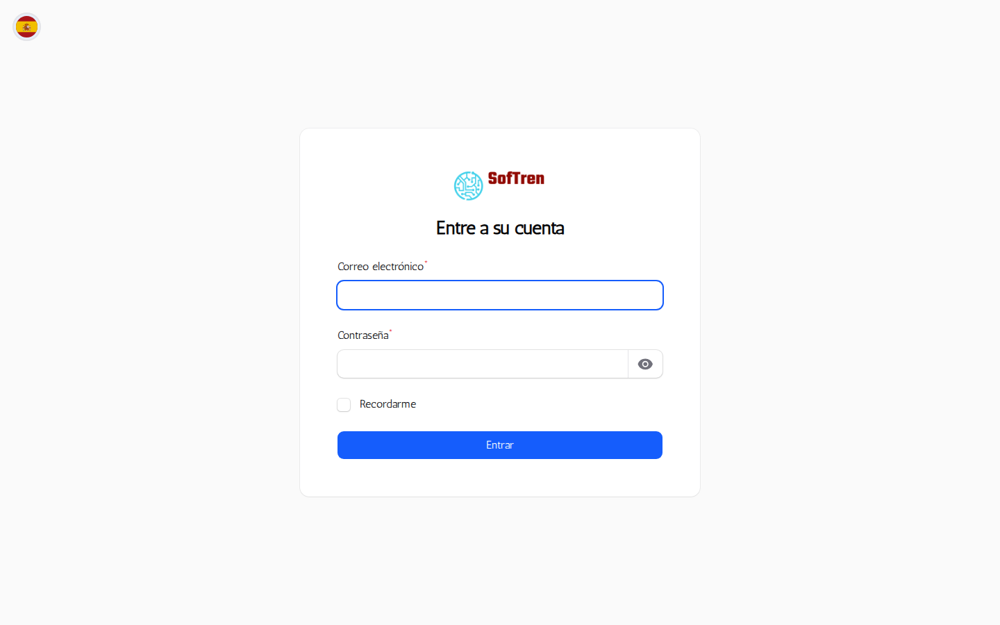
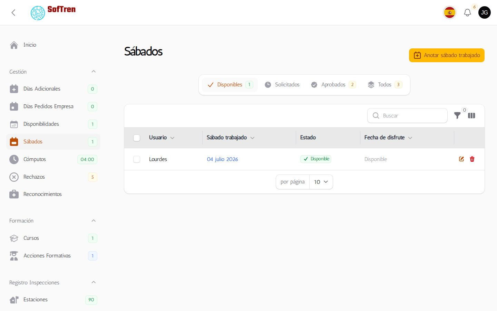
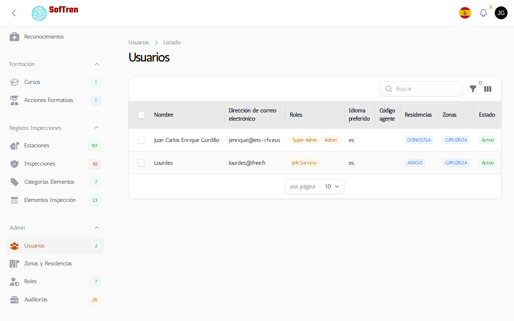
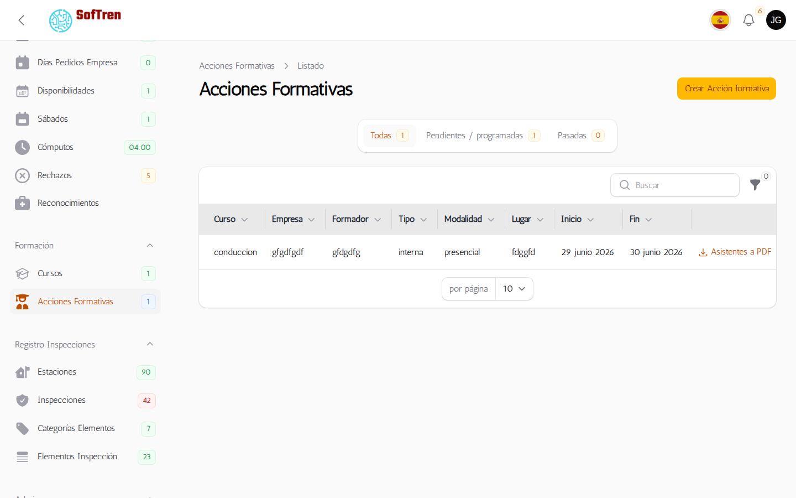
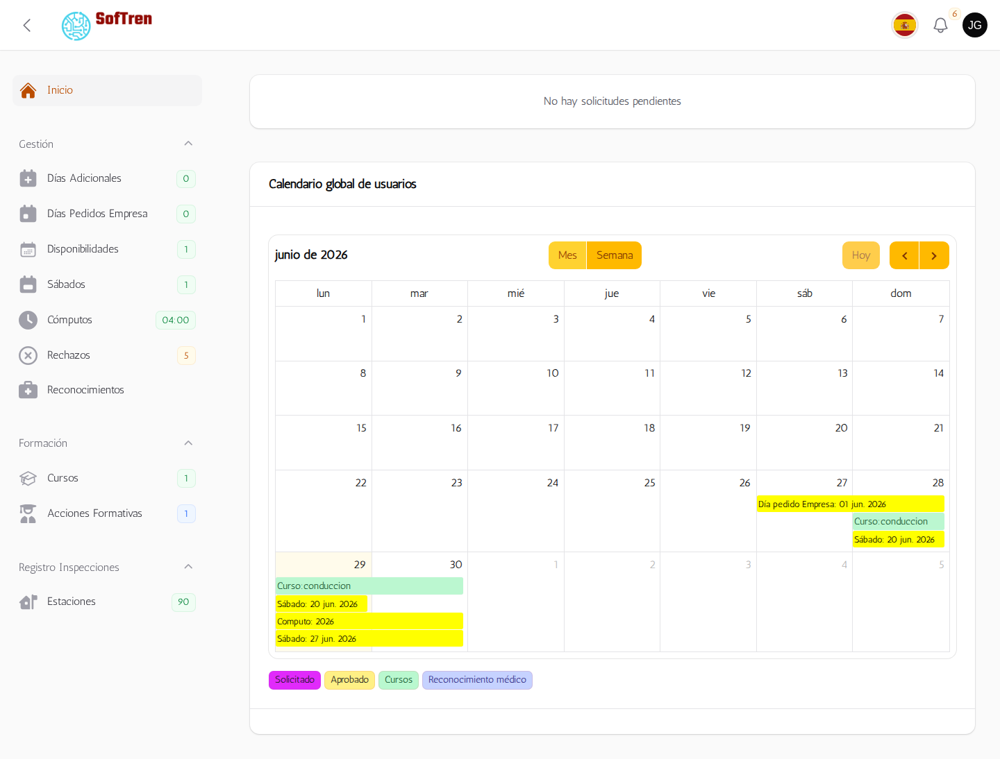
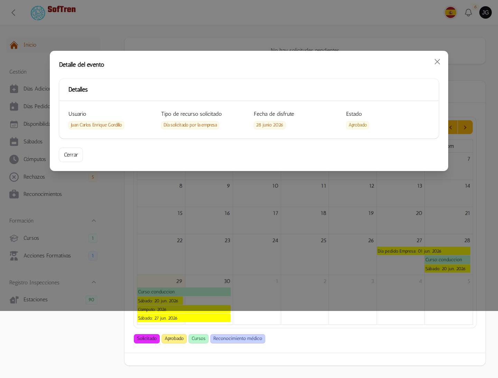
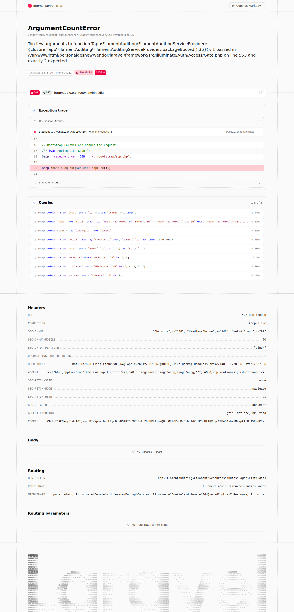
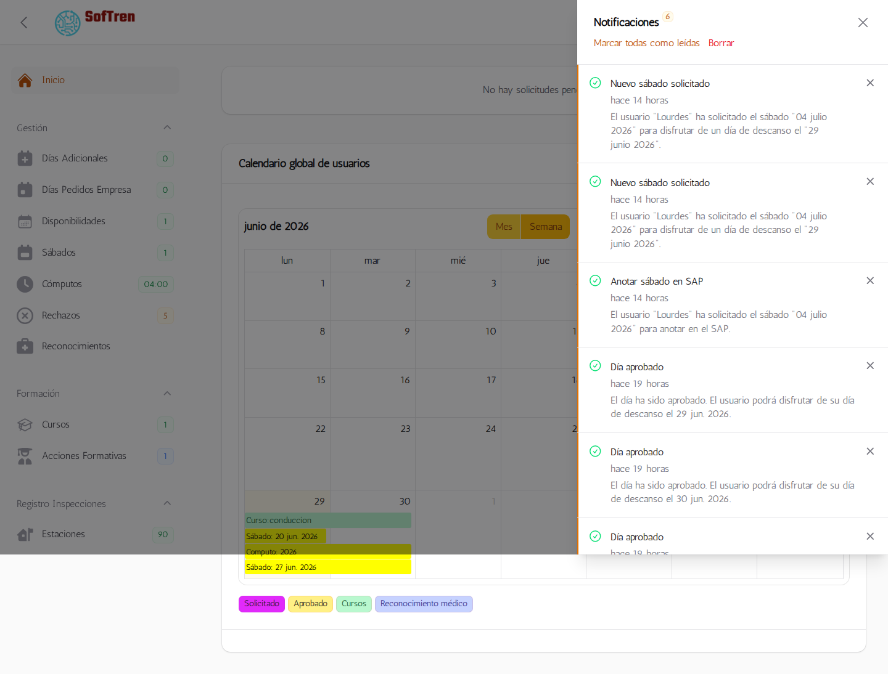

# Manual de Administrador

## Objetivo

Este manual explica las tareas del perfil administrador en PersonalGes: acceso, gestión diaria, validaciones y resolución de incidencias comunes.

## 1. Acceso al panel de administración

1. Abrir la URL de administración.
2. Introducir correo y contraseña corporativa.
3. Completar verificación de correo si aplica.

## 2. Vista general del panel

1. Revisar indicadores principales.
2. Revisar solicitudes pendientes.
3. Revisar calendario global.

## 3. Gestión de solicitudes

1. Abrir listado de solicitudes.
2. Filtrar por estado, usuario y fechas.
3. Aprobar o rechazar una solicitud.
4. En rechazo, indicar motivo.

## 4. Gestión de usuarios y roles

1. Acceder al módulo de usuarios.
2. Crear o editar usuario.
3. Asignar rol según permisos.

## 5. Formación y acciones formativas

1. Entrar al recurso de acciones formativas.
2. Filtrar por usuario o estado.
3. Revisar asistentes y fechas.

## 6. Calendario global

1. Cambiar entre vistas mensual, semanal y diaria.
2. Hacer clic en un evento para ver detalle.
3. Revisar usuario asociado y asistentes en cursos.

## 7. Auditoría y seguimiento

1. Revisar cambios en auditoría.
2. Validar quién cambió cada registro.

## 8. Notificaciones

1. Consultar notificaciones en campana.
2. Abrir detalle y confirmar estado.

## 9. Incidencias frecuentes

### No puedo iniciar sesión

- Revisar credenciales.
- Revisar conexión LDAP.
- Revisar si el usuario está activo.

### No aparecen datos en panel

- Revisar filtros activos.
- Revisar permisos del rol.
- Revisar estado de colas y scheduler.

### No se envían correos

- Revisar configuración de correo.
- Revisar conectividad SMTP.

## 10. Buenas prácticas

1. Validar cada aprobación antes de confirmar.
2. Dejar trazabilidad en rechazos.
3. Evitar cambios masivos sin revisión previa.

## Historial de cambios del manual

- v1.0: estructura inicial.
