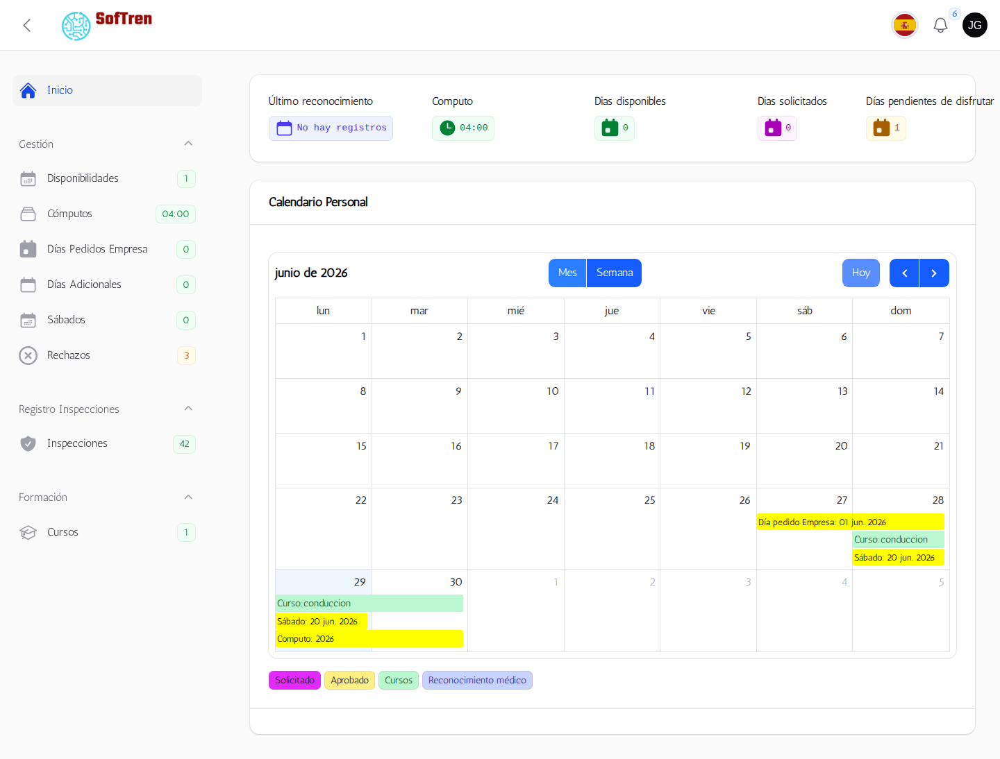
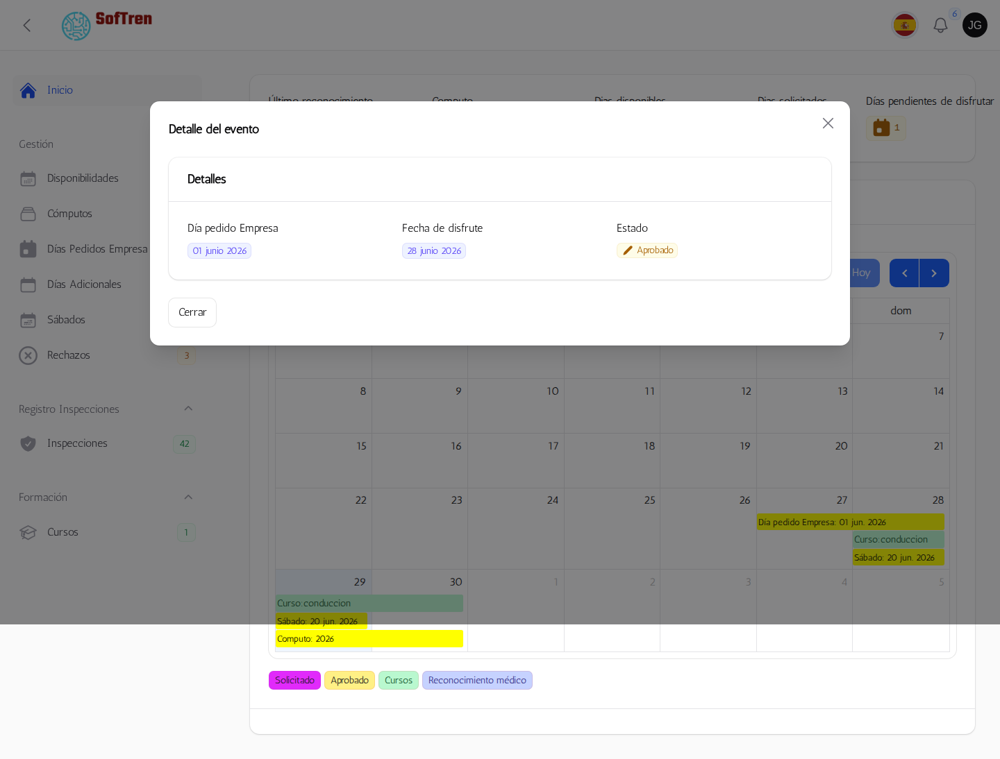
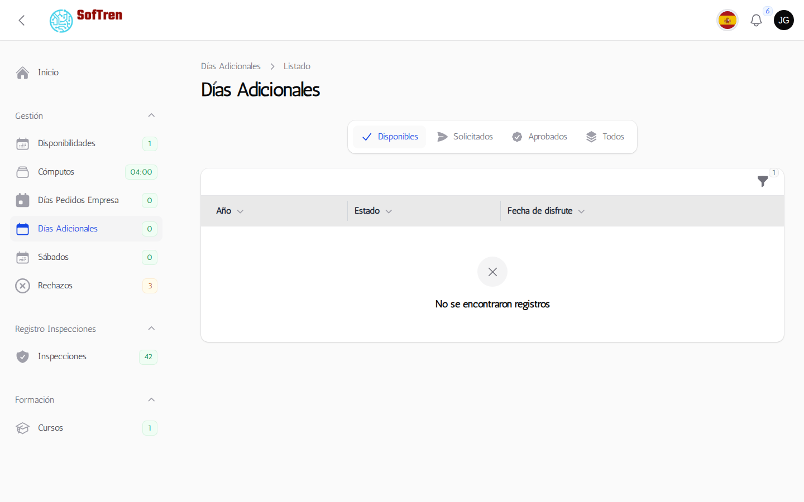
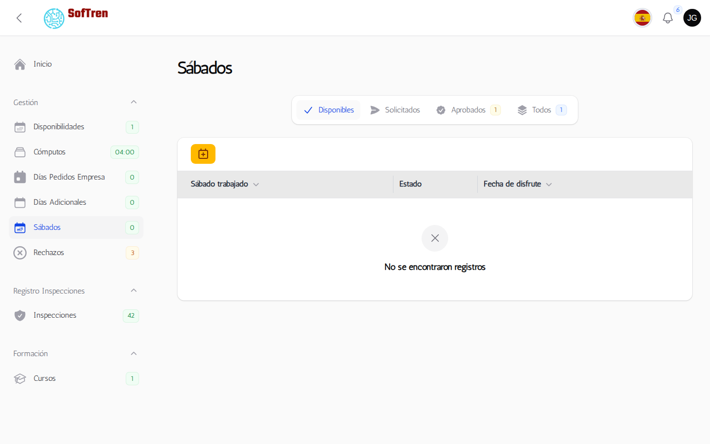
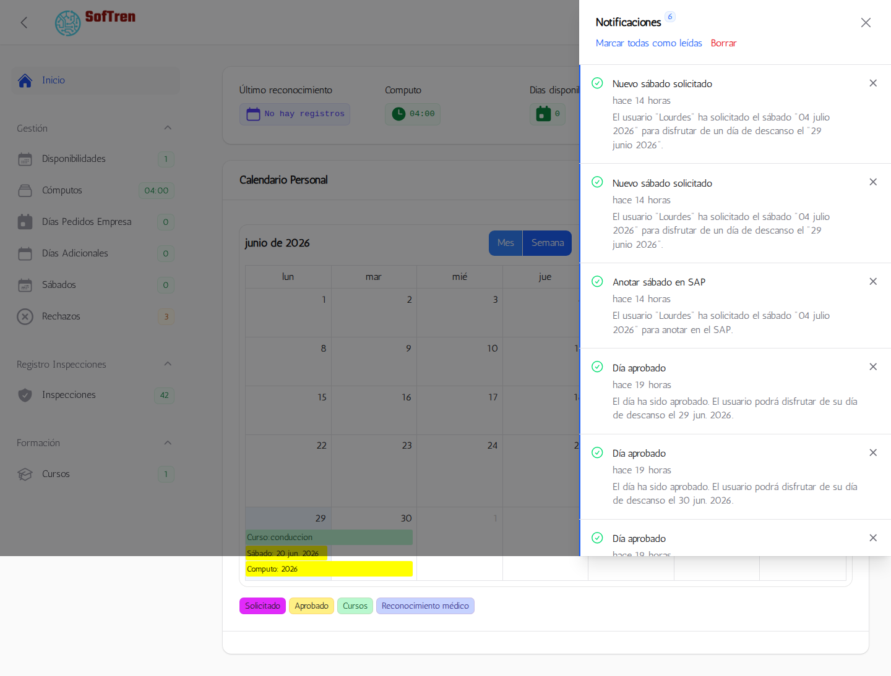
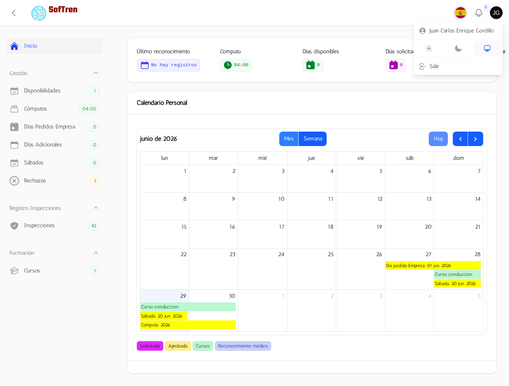

# Manual de Usuario

## Objetivo

Este manual explica el uso diario de PersonalGes para usuarios no administradores: acceso, solicitudes, seguimiento y notificaciones.

## 1. Inicio de sesión

1. Abrir la URL de la aplicación.
2. Introducir correo y contraseña.
3. Confirmar correo si se solicita.

## 2. Panel principal

1. Revisar resumen personal.
2. Consultar solicitudes pendientes.
3. Revisar eventos en calendario personal.

## 3. Calendario personal

1. Cambiar vista del calendario.
2. Consultar días solicitados y aprobados.
3. Abrir detalle de cada evento.

## 4. Solicitud de días

1. Abrir módulo correspondiente.
2. Seleccionar fecha o periodo.
3. Confirmar solicitud.
4. Esperar validación del administrador.

## 5. Estado de solicitudes

1. Revisar estado en listado.
2. Estados posibles:

- Solicitado
- Aprobado
- Rechazado

## 6. Notificaciones

1. Abrir campana de notificaciones.
2. Consultar aprobaciones o rechazos.
3. Revisar motivo en caso de rechazo.

## 7. Perfil y ajustes

1. Revisar datos personales.
2. Configurar idioma si aplica.

## 8. Preguntas frecuentes

### No puedo entrar

- Revisar contraseña.
- Revisar correo corporativo.
- Contactar con administrador.

### Mi solicitud no cambia de estado

- Revisar notificaciones.
- Esperar validación administrativa.
- Contactar si hay retraso.

### No veo un módulo

- Puede depender del rol asignado.

## 9. Buenas prácticas

1. Solicitar con antelación.
2. Revisar fechas antes de confirmar.
3. Consultar notificaciones tras cada cambio.

## Historial de cambios del manual

- v1.0: estructura inicial.
