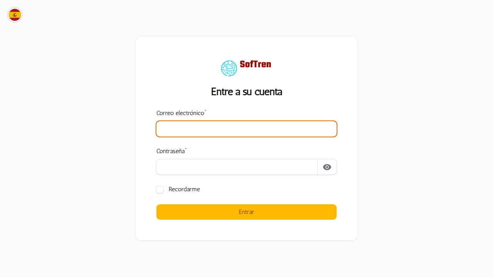

# Manual de Administrador — Aplicación

**Idioma:** Español (España)
**Nivel:** Básico

## Introducción
Resumen de tareas de administrador y alcance del manual.


## Requisitos previos
- Acceso administrador (rol con permisos de Filament)
- Acceso SSH al servidor (si aplica)

## Acceso al panel de administrador
1. Navegar a `http://127.0.0.1/admin`.
2. Iniciar sesión con una cuenta con rol `super_admin` o similar.
3. Desde el menú lateral, acceder a usuarios, auditorías y recursos administrativos.

## Gestión de usuarios y roles
- Crear/editar usuarios desde el panel de administración.
- Asignar roles (p. ej. `jefe_servicio`, `tecnico_red`, `admin`, `super_admin`).
- Comprobar permisos antes de activar un nuevo rol.



## Auditoría y seguridad
- Consultar registros de auditoría para cambios de usuarios y recursos.
- Revisar accesos recientes en el panel de auditoría.


## Mantenimiento básico
- Ver logs de la aplicación: `storage/logs/laravel.log`.
- Limpiar cachés:

```bash
php artisan cache:clear
php artisan route:clear
php artisan config:clear
php artisan view:clear
```

## Backups (básico)
- Exportar base de datos (mysqldump) y copiar `storage`.
- Verificar el procedimiento de restauración.

## Configuración de LDAP
- En el archivo de configuración [config/ldap.php](config/ldap.php) revisar parámetros de conexión.

## Exportes y PDFs
- Cómo forzar exportes de inspecciones y cursos desde las rutas públicas protegidas.

## Actualizaciones y despliegue (básico)
- Pasos recomendados para desplegar nuevas versiones.

## Seguridad básica
- Mantener dependencias actualizadas.
- Revisar permisos de ficheros (`storage`, `bootstrap/cache`).

## Mantenimiento básico
- Ver logs de la aplicación: `storage/logs/laravel.log`.
- Limpiar cachés:

```bash
php artisan cache:clear
php artisan route:clear
php artisan config:clear
php artisan view:clear
```

## Backups (básico)
- Exportar base de datos (mysqldump) y copiar `storage`.
- Verificar el procedimiento de restauración.

## Configuración de LDAP
- En el archivo de configuración [config/ldap.php](config/ldap.php) revisar parámetros de conexión.

## Exportes y PDFs
- Cómo forzar exportes de inspecciones y cursos desde las rutas públicas protegidas.

## Actualizaciones y despliegue (básico)
- Pasos recomendados para desplegar nuevas versiones.

## Seguridad básica
- Mantener dependencias actualizadas.
- Revisar permisos de ficheros (`storage`, `bootstrap/cache`).

---

_Archivo generado automáticamente: borrador inicial para revisión._
