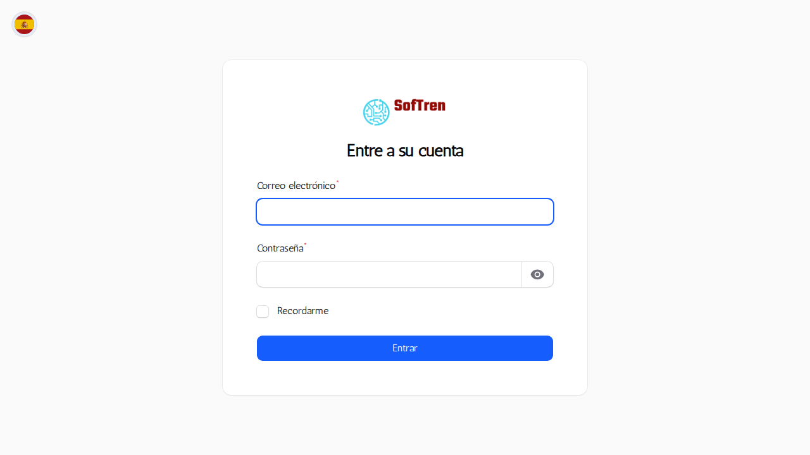

# Manual de Usuario — Aplicación

**Idioma:** Español (España)
**Nivel:** Básico

## Introducción
Breve descripción de la aplicación y propósito del manual.

## Requisitos previos
- Navegador moderno (Chrome, Firefox, Edge)
- Usuario con credenciales válidas

## Acceso
1. Ir a la URL de la aplicación.
2. Iniciar sesión con usuario y contraseña.

## Navegación general
- Barra lateral: acceso a módulos principales (Inspecciones, Cursos, Rechazos, Cómputos, Días Adicionales, Sábados, etc.).
- Cabecera: idioma, notificaciones y menú de usuario.
- Panel central: información rápida y calendario.

## Módulo: Inspecciones
1. Abrir el listado de inspecciones desde la barra lateral.
2. Buscar y filtrar por estación, tipo o fecha.

3. Crear inspección:
   - Pulsar el botón "Crear".
   - Rellenar fecha y hora.
   - Seleccionar tipo: Periódica o Especial.
   - Elegir estación y los agentes responsables.
   - Si es "Especial", completar tema, cuestiones objeto de la inspección y acciones.
   - Guardar.

4. Editar inspección: abrir la inspección y pulsar "Editar".
5. Exportar PDF: usar el botón "Exportar" en la vista de detalle.

## Módulo: Cursos
- Acceder al listado de cursos desde la sección "Formación".
- Crear y editar cursos con datos básicos de nombre, descripción y fechas.
- Generar listados de asistentes y exportarlos a PDF.

## Módulo: Rechazos
- Registro de rechazos: crear, editar y consultar rechazos.
- Filtrar por estado o fecha para localizar registros.

## Módulo: Cómputos
- Consultar y gestionar los cómputos desde la sección correspondiente.
- Filtrar por fecha, estación o técnico responsable.

## Documentos y exportes
- Cómo generar PDFs desde la vista de detalle (Inspecciones, Cursos).

## Soporte y contacto
- Contacto del equipo de soporte y pasos a seguir en caso de error.
- Anotar el mensaje de error o la acción realizada y compartirlo con soporte.

## Ubicación de las capturas
Las imágenes usadas en este manual están guardadas en `docs/screenshots/`.

---

_Archivo generado automáticamente: borrador inicial para revisión._
